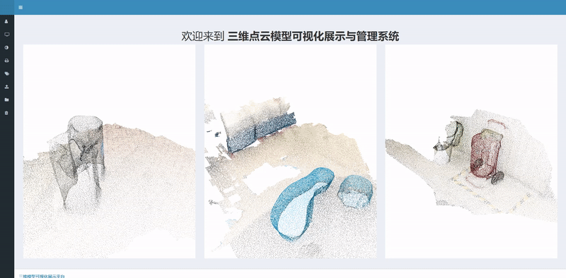

# 1 项目介绍

本项目为本人毕业设计研究内容的展示系统，主要聚焦于三维点云上采样与语义分割应用。该系统包括了三维模型的算法处理展示、三维模型上传与管理、三维模型渲染管理等功能，现将其开源，以方便后续有做三维计算机视觉研究的同学做展示使用，也欢迎star/fork/pr/issue，帮助系统更好的完善 :-)

## 1.1 技术依赖

- 前端依赖：jQuery + Bootstrap3 + ThreeJS + Font-Awesome

- 后端依赖：Django

- 其它依赖：TensorFlow

## 1.2 功能介绍

### 1.2.1 展示模块

该模块主要为三维模型的算法处理展示，包括了点云上采样展示、场景上采样展示、分割数据集展示、场景分割展示等功能，展示内容一般为原始模型、处理生成模型和标准模型。

### 1.2.2 模型管理模块

该模块是一个简易的文件管理系统，主要为对三维点云模型进行管理，包括了创建目录、重命名目录、删除目录、上传模型、查看模型、下载模型、移动模型、删除模型、上采样模型、回收站管理等功能。

### 1.2.3 模型渲染模块

该模块主要为对三维模型进行网页端的渲染控制，通过调节参数以达到理想的渲染效果。

# 2 环境配置

1. 创建虚拟环境**visapp**并激活（默认当前已在项目根目录**PCVisAPP**）。

    ```shell
    conda create -n pcvisapp python=3.6 --yes
    conda activate pcvisapp
    ```

2. 安装Python Package依赖。

    ```shell
    pip install -r requirements.txt
    ```

3. 编译tf算子。注意，如果当前环境不方便安装tensorflow-gpu或者没有GPU可忽略本步骤，但为了确保系统仍能够正常运行，需要将`PointCloudManage/utils.py`中的代码`from PointCloudManage.upsample_op.model import Model`注释，并适当修改方法`upsample_points`。实际上，方法`upsample_points`的目标即调用基于tf的神经网络对三维点云模型进行上采样操作，该方法内也可替换成你的点云处理算法。

    ```shell
    cd PointCloudManage/upsample_op/tf_ops
    sh compile_ops.sh
    ```

4. 下载[参考测试数据](https://drive.google.com/file/d/1hb78WSrDIp2GRBp63lhRISAsDxK-y7_o/view?usp=sharing)。本步骤为可选，可将[参考测试数据](https://drive.google.com/file/d/1hb78WSrDIp2GRBp63lhRISAsDxK-y7_o/view?usp=sharing)解压并覆盖于`static`目录下。

    - [下载链接：Google Drive](https://drive.google.com/file/d/1hb78WSrDIp2GRBp63lhRISAsDxK-y7_o/view?usp=sharing)

    - [下载链接：百度云（提取码：i353）](https://pan.baidu.com/s/1vbjg-n5-DBMyE-55gNg6jw)

5. 运行系统。运行之前需要修改`PointCloudManage/upsample_op/config.py`内`CFG.gpu`为可使用的GPU。

    ```shell
    python manage.py runserver 0.0.0.0:<ip_port>
    ```

# 3 效果展示

## 3.1 主页



## 3.2 展示模块

### 3.2.1 点云上采样展示


### 3.2.2 场景上采样展示


### 3.2.3 分割数据集展示


### 3.2.4 场景分割展示


## 3.3 模型管理模块

### 3.3.1 模型上传


### 3.3.2 模型管理


### 3.3.3 模型删除与回收站


## 3.4 模型渲染模块

### 3.4.1 obj渲染


### 3.4.2 ply渲染


# 4 更进一步

1. 用户权限管理系统

2. 渲染页面自动生成系统

# 5 参考项目

[[1] TensorFlow](https://www.tensorflow.org/)

[[2] jQuery](https://jquery.com/)

[[3] Bootstrap · The most popular HTML, CSS, and JS library](https://getbootstrap.com/)

[[4] Three.js - JavaScript 3D Library](https://threejs.org/)

[[5] Font Awesome, the iconic font and CSS toolkit](https://fontawesome.com/v4/)

[[6] Django - The Web Framework for Perfectionists with Deadlines](https://www.djangoproject.com/)

[[7] PU-GAN: a Point Cloud Upsampling Adversarial Network](https://github.com/liruihui/PU-GAN)

[[8] AdminLTE - Bootstrap 4 Admin Dashboard](https://github.com/ColorlibHQ/AdminLTE)
